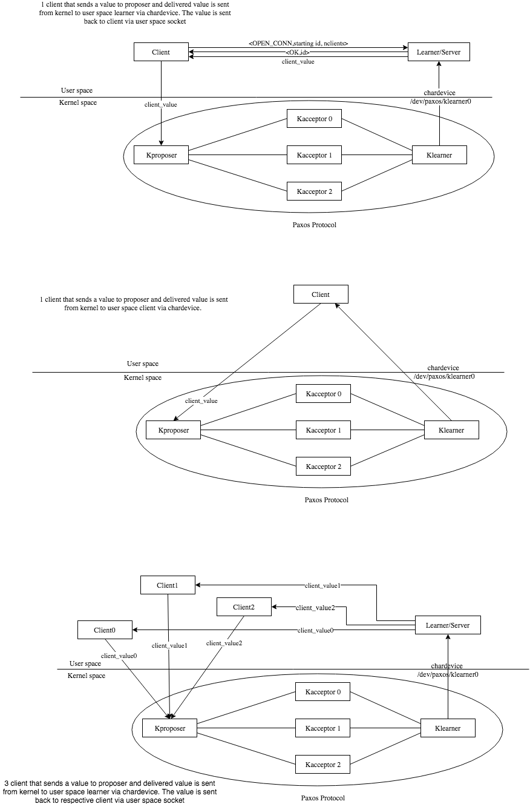

# Kernel_Paxos
Kernel Modules that implements Paxos protocol

Tested on Ubuntu 17.04 zesty, kernel 4.10.0-33-generic and CentOS Linux kernel 3.10.0.

The logic implementation of Paxos protocol used in these modules has been taken from [Libpaxos](http://libpaxos.sourceforge.net/)

You need to have libevent-2.18 or later versions.

### <u> **Important:** Replica and User space Clients are still in development </u>

## Description
### Kernel space
There are 5 kind of modules: KAcceptor, KProposer, KLearner, KClient and KReplica.

<b>KAcceptor</b>: Simulates the role of an Acceptor.  
It receives 1A (prepare) and 2A (accept request) from a Proposer, and sends it back 1B (promise) and 2B (accepted). It also sends 2B messages to all the Learners.

<b>KProposer</b>: Simulates the role of a Proposer.  
It sends 1A (prepare) and 2A (accept request) to the Acceptors, receiving back 1B (promise) and 2B (accepted). It also receives CVs (Client Values) from Client.

<b>KLearner</b>: Simulates the role of a Learner.  
A Learner receives 2B (accepted) messages from Acceptor and delivers them to the User space application(s).

<b>KClient</b>: Simulates the role of a Client and Learner.  
 The KClient sends a message to a KProposer, waiting that its internal Learner receives the value back. It keeps track of the delay between sending and receiving to calculate statistics (troughput, latency). The KClient can be substituted by the Client application in User space

<b>KReplica</b>: Simulates the role of an Replica. 
 A Replica contains the logic of Proposer, Acceptor and Learner.

### User space

There are 2 kind of User space applications: Client and Learner.

<b> Client</b>: Sends message to the Proposer that is in kernel space. The Client can connect to a KLearner either via chardavice or via TCP connection with an User space Learner application.

<b> Learner</b>: Connects to a KLearner via chardevice. It sends received value to the Client through User space TCP connection.

These are some of the possible connections that can be created. 
Other examples include using Replica instead of Proposer + 3 Acceptors and kernel instead of User space Clients.  

## Difference from Libpaxos

There are some differences between Kernel_Paxos and Libpaxos, since it uses libevent, msgpacker and khash.
These are User space libraries, that cannot be used in kernel modules. However, libevent is still being used in User space applications.

<b> libevent</b>: used to handle asynchronous timeouts and TCP connections between all Libpaxos roles. Kernel_Paxos uses raw ethernet frames.

<b> msgpacker</b>: used to serialize messages, so that they can be read by big and little endian platforms. Kernel_Paxos uses a custom-made variant of it.

<b> khash</b>: khash uses floating point internally, which cannot be used inside the Linux kernel, for portability reasons. Therefore uthash was preferred, since it does not use floating point operations.

<b>lmdb</b>: Libpaxos offers the use of a database where values can be saved permanently. This is not implemented here, everything is kept in memory.

In addition the aforementioned, there are little changes in the logic:
- Since communication is connectionless, any KAcceptor must know the address of KLearners. Therefore, once a KLearner is started, it sends "hi" to the KAcceptor, that saves the receiving address and replies back "ok". If a KAcceptor does not reply back, the Learner keeps sending "hi" to the given addresses.

- A KLearner also sends a "delete" message to the KAcceptor when it is being unloaded, so that it can delete its entry from the known addresses.

- Since a Client value can be lost (connectionless communication), the Client waits at most one second for receiving it back. If no value is received in that period of time, it sends the value again to the KProposer. This feature is also implemented inside the KClient.

- The maximum ethernet frame size is 1500, and bigger packets will be only sent partially. The application must care about limiting the data size.

## How to run

You first need to compile everything. To compile, run `make`. Once compiled, all executables will be inside the folder `build`.

To load a kernel module type `sudo insmod module_name.ko parameters`.  
To unload it, `sudo rmmod module_name.ko`.  
`module_name` is the name of the module.

To run an User space application type `sudo ./application_name`.

Note that both kernel modules and User space applications need `sudo` privileges in order to work.

### Parameters

Each module and user application has its parameters. Parameters info of kernel modules can be seen by calling `modinfo module_name.ko`. Parameters info of applications can be seen by calling the application with `-h` flag. All parameters can be inserted in any order.

### Order of execution

It is recommended to firstly load all KAcceptors, then KProposers, and then KLearners. 
Once they all are loaded, Learner in User space can be executed, and then finally client in user space can start.  

## Disclaimer

As any possible kernel module, also these modules are prone to crash.
 In case of module crash or severe kernel panic (mouse not working, screen freezed etc.) the only thing you can do is reboot the machine. I am not responsible of any use or damage they can create.  
