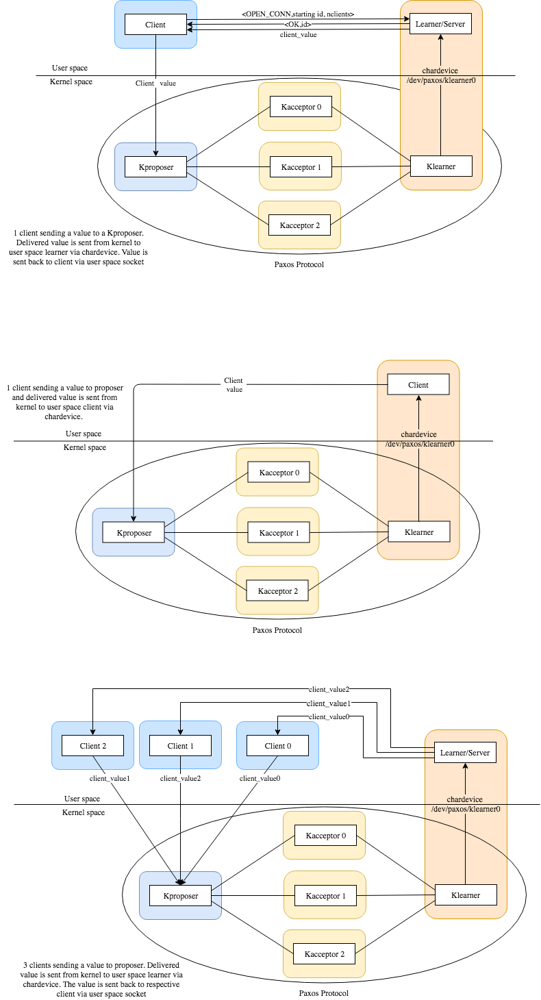

# Kernel_Paxos
Kernel Modules that implements Paxos protocol

Tested on Ubuntu 17.04 zesty, kernel 4.10.0-33-generic.

The logic implementation of Paxos protocol used in these modules has been taken from [libpaxos](http://libpaxos.sourceforge.net/)

You need to have libevent2.18 or later versions.
## Description
### Kernel space
There are 5 kind of modules: Kacceptor, Kproposer, Klearner, Kclient and Kreplica.

<b>Kacceptor</b>: Assumes the role of an acceptor in Paxos protocol. An acceptor receive 1A (prepare) and 2A (accept request) from proposer, and sends back 1B to proposer (promise) and 2B (accepted) to learners and proposer.

<b>Kproposer</b>: Assumes the role of a proposer in Paxos protocol. A proposer send 1A (prepare) and 2A (accept request) to acceptor, and receive 1B (promise) 2B (accepted) from acceptor, and CV (client value) from client.

<b>Klearner</b>: Assumes the role of a learner in Paxos protocol.
Learner receives 2B (accepted) messages from acceptor and deliver to user space application.

<b>Kclient</b>: Assumes the role of a client and learner in Paxos protocol. The kclient send a message to a kproposer, and
in the same time make a learner start so it will receive the value it sent. It keeps track of the delay from the sent to the received moment to calculate statistics. The kclient can be substituted by the client application in user space

<b>Kreplica</b>: Assumes the role of an replica in Paxos protocol. A replica contains the logic of proposer, acceptor and learner.

### User space

There are 2 kind of user space applications: Client and Learner.

<b> Client</b>: Sends message to the proposer that is in kernel space. The client can either attach via chardavice to a Klearner, or receive the client value (to calculate statistics) via user space socket by the user space Learner application.

<b> Learner</b>: Attaches to a Klearner via chardevice. It sends received value to the client through user space sockets.

These are some of the possible connections that can be created.<br>
Other examples include using replica instead of proposer and 3 acceptors and using kclients instead of user space application.<br>


## Files
The structure of the project is organized as follows:
```
.
├── kpaxos                  // User space applications and Kernel modules
│   ├── include
│   │   └── *header files*
|   |
--------KERNEL MODULES----------
│   ├── kacceptor.c         
│   ├── kclient.c
│   ├── klearner.c
│   ├── kproposer.c
│   ├── kreplica.c          
---------------------------------
|   |
--------USER SPACE APPLICATIONS----------
│   ├── user_app.c
-----------------------------------------
|   |
│   └── *other files*
|
├── evpaxos                 // handle received packets
│   ├── include
│   │   └── *header files*
│   ├── config.c            // where all ip and configurations are given
│   └── *other files*

|
├── paxos                   // internal logic of paxos, instance handling and hashmap
│   ├── include
│   │   └── *header files*
│   └── *other files*
|
-------------------SCRIPTS (see Scripts section) ---------------------
├── prop_acc.sh           // start 1 proposer 3 acceptors
├── learn.sh              // start learners
├── replica.sh            // start replicas
├── run.sh                // start up to two different kind of modules
----------------------------------------------------------------------
|
├── LICENSE
├── Makefile
└── README.md
```

## Difference from libpaxos

There are some difference between Kernel_Paxos and Libpaxos: first of all, Libpaxos uses libevent, msgpacker and khash.
Obviously, these are user space libraries, that cannot be used in kernel programming. However, I still use libevent in the user space applications.

<b> libevent</b>: libevent handled asynchronous timeout handling and tcp connections. I had to implement them manually. I use UDP connection and the timeout is calculated after the udp_server_receive blocking call (if nothing is received, block lasts for 100 ms, then unblock).

<b> msgpacker</b>: msgpacker is used to pack the message to send, so the message can be read by big and little endian platforms. I had to do it manually too, manipulating the integers and checking the `_BIG_ENDIAN` and `_LITTLE_ENDIAN` flags inside the kernel.

<b> khash</b>: khash uses floating point internally, and the kernel does not like it. Therefore I used uthash, that is an hashmap that does not use floating point operations.

<b>lmdb</b>: libpaxos offers the option to use a db where the values can be saved permanently. This is not implemented here, everything is kept in memory.

In addition to this, there are little changes in the logic:
- Since the communication is in UDP, the kacceptor must know what is the address of klearners. Therefore, when a klearner is started, sends an "hi" to the kacceptor, that saves its ip replies back "ok". If a kacceptor does not reply back, the learner keeps sending "hi" to the given address.

- The kleaner also sends a "del" to the kacceptor when it is being unloaded, so the kacceptor can delete its entry from the known ip addresses.

- Since the client value sent from the client can is sent in UDP, it can be lost. Therefore the client sends the value and waits 1 second for delivering by the learner. If in one second the value is not received, it resends the value to the kproposer. This is not implemented in kclient.

- In libpaxos, trim is never called. Here, kernel memory is way smaller than the portion used in user space. Therefore a trim has to be called periodically, otherwise the application will crash.

- The maximum packet size in UDP is 65507, as defined in `kernel_udp.h`. Bigger packets will be only sent partially. The application must care about limiting the data size.


## How to run

You first need to compile everything. Please refer to next section to select which module to compile. Once compiled, the command to load a kernel module is `sudo insmod module_name.ko parameters`. To unload it is `sudo rmmod module_name.ko`. `module_name` is the name of the module. The command to run an application is `./application_name`.

### Compiling
Since there are a lot of different configurations to make paxos protocol working (3 replicas and one client, 1 proposer 3 acceptor 1 client, multiple clients, multiple learners, ecc... ), it might be necessary to modify the Makefile to add/remove modules. This is needed when you want for example multiple acceptors in the same machine, because you will need to compile multiple modules.

To add/remove a module, you just need to modify the `obj-m` list of files. In addition, for each file added/removed, you must also modify the filename-y entry.<br> For example, let's say a new acceptor is needed:<br>
Go to `obj-m` list and add to the last line the entry kacceptor3.ko<br>
`obj-m += \` <br>
`kclient0.o \` <br>
`kclient1.o \` <br>
`kclient2.o \` <br>
`kacceptor0.o \` <br>
`...` <br>
`kreplica2.o ` change this line to this `kreplica2.o kacceptor3.ko`<br>

Then, since we are adding a kacceptor, add it to the kaccepttor section<br>
`kacceptor0-y:= $(ACC_OBJ)`<br>
`kacceptor1-y:= $(ACC_OBJ)`<br>
`kacceptor2-y:= $(ACC_OBJ)`<br>
`kacceptor3-y:= $(ACC_OBJ)` <-- add this line<br>

The makefile also creates 2 user_app applications, that can be used as client or learner.

<b> The default Makefile creates 3 kclients, 1 kproposer, 3 kacceptors, 5 klearners, 3 replicas and 1 user_app. <br>
Each of these is identified by the module type + progressive id. For example, 3 kclients means there are kclient0.ko kclient1.ko and kclient2.ko. <br> All these modules are necessary if everything has to run in one machine, while they are superflous if they run in multiple machine (1 module .ko in every machine will be fine) </b>

### Parameters

Each module and user application has its parameters. Parameters info of kernel modules can be seen by calling `modinfo module_name.ko`. Parameters info of applications can be seen by calling the application with `-h` flag. All parameters can be inserted in any order.

<b>Kacceptor</b>: `sudo insmod kacceptor.ko id=X`, where `id=X` is the id of the acceptor.

<b>Kproposer</b>: `sudo insmod kproposer.ko id=X`, where `id=X` is the id of the proposer.

<b>Klearner</b>: `sudo insmod klearner.ko id=X cantrim=Y catch_up=Z`, where `id=X` is the id of learner, `cantrim=Y` is a boolean (1/0) to say whether the klearner is allowed to send trim to acceptor and proposers, and `catch_up=Z` is a boolean to say whether the learner get all the values accepted by acceptors that has missed from iid 1 (this is helpful in case a new learner is added later). If no trim is specified by user application, the module automatically calls trim for it instances % 100000 (does not send trim to anyone). <b>It is higly recommended to send the trim call to acceptors</b>. The reason for that is that the kernel memory will fill up really quickly, and once full everything will crash.

<b>Kclient</b>: `sudo insmod kclient.ko id=X proposer_id=Y outstanding=W value_size=Z`, where `id=X` is the id of learner, `proposer_id=Y` is the id of the proposer that will receive the client value, `outstanding=W` set how many values should the client send each time, and the `value_size=Z` set how big the message will be.

<b>Kreplica</b>: `sudo insmod kreplica.ko id=X cantrim=Y`, where `id=X` is the id of the replica and `cantrim=Y`is a boolean (1/0) to say whether the klearner is allowed to send trim to acceptor and proposers.

<b>user_app</b>: `Usage: ./user_app [-h] [-o] [-v] [-p] [-c] [-l] [-d] [-s]
`.<br>
`-h` display help<br>
`-o number` set outstanding value<br>
`-v number` set value size<br>
`-p number` set proposer id, which proposer to send the values<br>
`-c` the application is a client, sends the values<br>
`-l trimvalue`  the application is a learner, only receives values and send trim every `trimvalue` accepted instances<br>
`-d number` set the connection with the klearnerX module through chardevice (ex `-d 2` connects to `klearner2`) <br>
`-s ip port` connects to the learner/client associated to that ip and port.

<b>Note:</b> Either `-c` or `-l trimvalue` must be provided at runtime. A client can only use one between `-d` and `-s`, while the learner can use both together but must always use `-d`.

<b>Note2:</b> When using the `-d` flag, the application connects to the chardevice
that is in kernel space, so higher privileges are needed. Run the application with `sudo`.

### Config file

In libpaxos, there is a config file that is read by applications at startup.
However this is not possible/safe to be done in kernel space, so for now the
parameters are hardcoded inside `evpaxos/config.c` line 100 -120.
What can be changed is the ips of replicas or proposers or acceptors, the ports and the ids. However, all id must start from 0 and continue in increasing order. <br>
Something like `0 1 3` is not accepted. Since replicas and proposer configurations differs, also the client in user space connectiong to the proposer/replica has different addresses. The addresses are define in user_udp.c line 10.

About verbosity, there are 4 levels of verbosity: `quiet`, `debug`,`info` and `error`. Quiet prints only the module prints, info only the core prints, debug prints all printk inserted in the project, and error will print only the errors.

<b>WARNING:</b> with debug mode activated, the log will be full of prints. In the long run, this can cause to fill up the memory.

<b> Note:</b> Kernel modules do not print in the stdout. To see the kernel module prints, run the following command in the terminal `dmesg -wH`.

### Scripts

Since there are a lot of modules and parameters, I created some scripts to automatically run them. Parameters in square brackets are optionals. These scripts are useful when there are multiple modules to be loaded in the same machine, otherwise do not help a lot. The scripts are:

<b>run.sh</b>: <br>Usage `./run.sh module_name number [module_name number] [module_name number]`.<br>`module_name` is the name of module and `number` is the number of modules with that name you want. You must provide at least one module_name and one number. <br>Example: <br>`./run.sh kclient 3` Load 3 kclient modules, more specifically it will perform <br>`sudo insmod kclient0.ko id=0`<br>`sudo insmod kclient1.ko id=1` <br>`sudo insmod kclient2.ko id=2`. If a module is already loaded, it will be unloaded first. If one module cannot be loaded, unload all the others. The script compile everything before loading modules.

<b>learn.sh</b>: <br>Usage `./learn.sh number_of_learner [id_of_trim_learner]`.<br> `number_of_learner` is the number of learner modules you want to load (same as `number` in `run.sh`), and `id_of_trim_learner` is the id of the module (between the loaded ones) that will periodically call trim.<br>
Example:<br>
`./learn.sh 3 0` Load 3 klearner modules, where the first one (klearner0) can send trim to all other modules trim. More specifically <br>`sudo insmod klearner0.ko id=0 cantrim=1`<br>`sudo insmod klearner1.ko id=1 cantrim=0` <br>`sudo insmod klearner2.ko id=2 cantrim=0`.

<b>prop_acc.sh</b>: <br>Usage `./prop_acc.sh`. Loads 1 kproposer (kproposer0) and 3 acceptors (kacceptor0, kacceptor1, and kacceptor2 ). It internally uses `run.sh`.

<b>replica.sh</b>: (same as learner.sh) <br>Usage `./replica.sh number_of_learner [id_of_trim_learner]`.<br> `number_of_learner` is the number of replica modules you want to load (same as `number` in `run.sh`), and `id_of_trim_learner` is the id of the module (between the loaded ones) that will periodically call trim.<br>
Example:<br>
`./learn.sh 3 0` Load 3 klearner modules, where the first one (kreplica0) can send trim to all other modules trim. More specifically <br>`sudo insmod kreplica0.ko id=0 cantrim=1`<br>`sudo insmod kreplica1.ko id=1 cantrim=0` <br>`sudo insmod kreplica2.ko id=2 cantrim=0`.

### Order of execution

It is recommended to firstly load all kacceptors, then kproposers, and then klearners.<br>
Once they all are loaded, learner in user space can be executed, and then finally client in user space can start. <br>
In this way, kproposers can preexecute with the kacceptors, klearners can connect to kacceptors so they know where to deliver the 2B messages, klearners  can create the chardevice so the user space learner can connect, and user space learner can create the socket that will listen for incoming connection by clients.<br>
Example using scripts:<br>
`./prop_acc.sh`<br>`./learn.sh 1 0`<br>`sudo ./user_app -l 100000 -d 0 -s 127.0.0.1 9000`<br> `./user_app -c -s 127.0.0.1 9000`
## Known bugs

- Both configurations with 3 replicas and 3 acceptors with 1 proposer connected to 3 clients crashes after ~ 2 hours of uninterrupted work.<br>

- The catch_up flag does not work really well because since the modules must trim every at least 100000 iids, a learner catching up values that are already trimmed never gets to reach the current iid.

- If a klearner is unloaded while an user space learner is attached to its chardevice, the user learner crashes and goes in D (dead) state

## Disclaimer

As any kernel module, also these modules can crash. And as current implementation, these modules will crash at some point. While the crash are not severe enough to kill your machine, they might. <br>
 It is recommended to run these modules in a virtual machine. In case the modules crash, it is not possible to remove them anymore, unless a reboot is performed. <br>
 In case of module crash or severe kernel panic (mouse not working, screen freezed ecc...) the only thing you can do is reboot the machine. I am not responsible of any use or damage they can create.  
## TODO & ideas

- Config file to be read by module (for now parameters are hardcoded)
- replace uthash with fixed size circular buffer
- use netlink instead of chardevice, use multicast with netlink (fix user learner cpu usage 100%)
- add quorum of trim inside the acceptor to effectively send trim to everybody
- support of different message size values
- use a persistent storage instead of trimming the values in memory
- easier way to add objects in makefile, organize generated files in folders
- improve performances <br>max n of messages received in localhost: non-stop 450'000, client in paxos 20'000
max n of messages received in cluster: non-stop 80'000, client in paxos 3'000)
- use multi-threaded roles (1 thread receives messages and puts them in rcv-queue, 1 thread sends message in send-queue, 1 get the received message, process it and puts the resulting message in sending queue)
- proposer using 2 ports, one for receive from acceptor and one for receiving from client (if the throughput is maximum for both ports)
